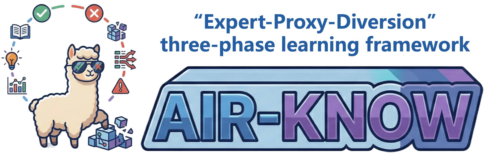
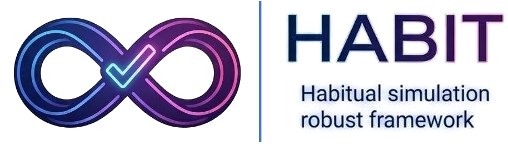
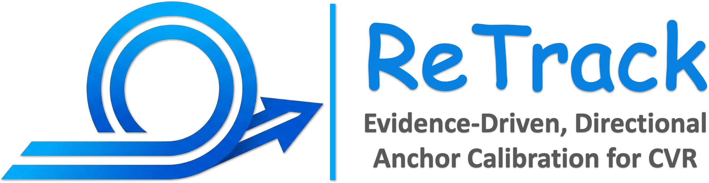
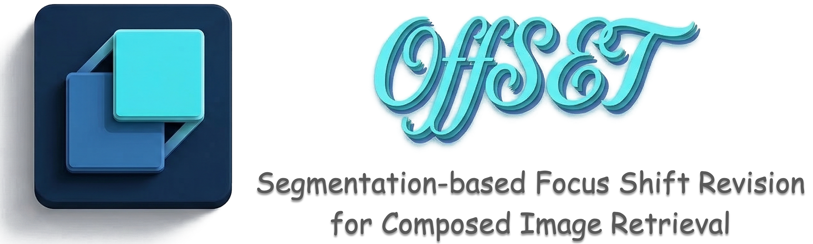








Hi, I am Zhiheng Fu (付志恒).
=====
I'm currently an Undergrad student in the [School of Software](https://www.sc.sdu.edu.cn), [Shandong University](https://www.sdu.edu.cn), under the supervision of Prof. [Liqiang Nie](https://liqiangnie.github.io/index.html) and Prof. [Yupeng Hu](https://faculty.sdu.edu.cn/huyupeng1/zh_CN/index.htm). 

My research interests include *multimedia computing, information retrieval*.
> 🤗 I am a strong advocate for open science. All the team projects I have been primarily involved in have been fully open-sourced. We warmly invite you to explore our projects, share your feedback, and connect with us for further discussion.

#  Our open source projects

Here's the link to our repo! Feel free to check it out. Any feedback or support are always welcome. Thanks for taking a look! ✨
 
<table style="width:100%; border:none; text-align:center; background-color:transparent;">
  <tr style="border:none;">
         <td style="width:30%; border:none; vertical-align:top; padding-top:30px;">
       
      <b>Air-Know (CVPR'26)</b> 
      
        <a href="https://zhihfu.github.io/Air-Know.github.io/" target="_blank">Web</a> | 
        <a href="https://github.com/zhihfu/Air-Know" target="_blank">Code</a> | 
        <!-- <a href="https://ojs.aaai.org/index.php/AAAI/article/view/37608" target="_blank">Paper</a> -->
      
    </td>
   <td style="width:30%; border:none; vertical-align:top; padding-top:30px;">
       
      <b>ConeSep (CVPR'26)</b> 
      
        <a href="https://lee-zixu.github.io/ConeSep.github.io/" target="_blank">Web</a> | 
        <a href="https://github.com/lee-zixu/ConeSep" target="_blank">Code</a> | 
        <!-- <a href="https://ojs.aaai.org/index.php/AAAI/article/view/37608" target="_blank">Paper</a> -->
      
    </td>
    <td style="width:30%; border:none; vertical-align:top; padding-top:30px;">
       
      <b>INTENT (AAAI'26)</b> 
      
        <a href="https://zivchen-ty.github.io/INTENT.github.io/" target="_blank">Web</a> | 
        <a href="https://github.com/ZivChen-Ty/INTENT" target="_blank">Code</a> | 
        <a href="https://ojs.aaai.org/index.php/AAAI/article/view/39181" target="_blank">Paper</a>
      
    </td>  
      </tr>
  <tr style="border:none;">
    <td style="width:30%; border:none; vertical-align:top; padding-top:30px;">
       
      <b>HABIT (AAAI'26)</b> 
      
        <a href="https://lee-zixu.github.io/HABIT.github.io/" target="_blank">Web</a> | 
        <a href="https://github.com/Lee-zixu/HABIT" target="_blank">Code</a> | 
        <a href="https://ojs.aaai.org/index.php/AAAI/article/view/37608" target="_blank">Paper</a>
      
    </td>
    <td style="width:30%; border:none; vertical-align:top; padding-top:30px;">
       
      <b>ReTrack (AAAI'26)</b> 
      
        <a href="https://lee-zixu.github.io/ReTrack.github.io/" target="_blank">Web</a> | 
        <a href="https://github.com/Lee-zixu/ReTrack" target="_blank">Code</a> | 
        <a href="https://ojs.aaai.org/index.php/AAAI/article/view/39507" target="_blank">Paper</a>
      
    </td>
    <td style="width:30%; border:none; vertical-align:top; padding-top:30px;">
       
      <b>HUD (ACM MM'25)</b> 
      
        <a href="https://zivchen-ty.github.io/HUD.github.io/" target="_blank">Web</a> | 
        <a href="https://github.com/ZivChen-Ty/HUD" target="_blank">Code</a> | 
        <a href="https://dl.acm.org/doi/10.1145/3746027.3755445" target="_blank">Paper</a>
      
    </td>
  </tr>
  <tr style="border:none;">
    <td style="width:30%; border:none; vertical-align:top; padding-top:30px;">
       
      <b>OFFSET (ACM MM'25)</b> 
      
        <a href="https://zivchen-ty.github.io/OFFSET.github.io/" target="_blank">Web</a> | 
        <a href="https://github.com/ZivChen-Ty/OFFSET" target="_blank">Code</a> | 
        <a href="https://dl.acm.org/doi/10.1145/3746027.3755366" target="_blank">Paper</a>
      
    </td>
    <td style="width:30%; border:none; vertical-align:top; padding-top:30px;">
       
      <b>ENCODER (AAAI'25)</b> 
      
        <a href="https://sdu-l.github.io/ENCODER.github.io/" target="_blank">Web</a> | 
        <a href="https://github.com/Lee-zixu/ENCODER" target="_blank">Code</a> | 
        <a href="https://ojs.aaai.org/index.php/AAAI/article/view/32541" target="_blank">Paper</a>
      
    </td>
  </tr>
</table>

# 🔥 News
- *2026.04.07*: &nbsp;🎉🎉 One paper (TEMA), was accepted by **ACL 2026**! Thanks to all co-authors!
- *2026.03.17*: &nbsp;🎉🎉 One paper (STABLE), was accepted by **TKDE 2026**! Congratulations to all co-authors!
- *2026.02.21*: &nbsp;🎉🎉 Two papers (ConeSep, Air-Know), were accepted by **CVPR 2026**! Thanks and Congratulations to all co-authors!
- *2025.11.08*: &nbsp;🎉🎉 Three papers were accepted by **AAAI 2026**! Thanks and Congratulations to all co-authors!
- *2025.10.18*: &nbsp;🎉🎉 As the core member, our team wins the Grand Prize in the CICAS Smart Power Scenario Competition. Congratulations to all team members!
- *2025.07.05*: &nbsp;🎉🎉 Two papers have been accepted by **ACM MM 2025**! Congratulations to our co-authors!
- *2024.12.10*: &nbsp;🎉🎉 One paper has been accepted by **AAAI 2025**! Congratulations to our co-authors!

# 📝 Selected Publications [[Full Publications Here]](/publications/)

ACL 2026

**TEMA: Anchor the Image, Follow the Text for Multi-Modification Composed Image Retrieval**

[Zixu Li](https://lee-zixu.github.io), [Yupeng Hu](https://faculty.sdu.edu.cn/huyupeng1/zh_CN/index.htm)✉, [***Zhiheng Fu***](https://zhihfu.github.io), [Zhiwei Chen](https://zivchen-ty.github.io/), [Yongqi Li](https://liyongqi67.github.io/), [Liqiang Nie](https://liqiangnie.github.io/index.html)

CVPR 2026

**Air-Know: Arbiter-Calibrated Knowledge-Internalizing Robust Network for Composed Image Retrieval** [*Coming Soon*]

[***Zhiheng Fu***](https://zhihfu.github.io), [Yupeng Hu](https://faculty.sdu.edu.cn/huyupeng1/zh_CN/index.htm), Qianyun Yang, Shiqi Zhang, [Zhiwei Chen](https://zivchen-ty.github.io/), [Zixu Li](https://lee-zixu.github.io)

CVPR 2026

**ConeSep: Cone-based Robust Noise-Unlearning Compositional Network for Composed Image Retrieval** [*Coming Soon*]

[Zixu Li](https://lee-zixu.github.io), [Yupeng Hu](https://faculty.sdu.edu.cn/huyupeng1/zh_CN/index.htm), [Zhiwei Chen](https://zivchen-ty.github.io/), [Mingyu Zhang](https://zh-mingyu.github.io/), [***Zhiheng Fu***](https://zhihfu.github.io), [Liqiang Nie](https://liqiangnie.github.io/index.html)

<!-- 

AAAI 2026

 

**ReTrack: Evidence-Driven Dual-Stream Directional Anchor Calibration Network for Composed Video Retrieval** [*Coming Soon*]

[Zixu Li](https://lee-zixu.github.io), [Yupeng Hu](https://faculty.sdu.edu.cn/huyupeng1/zh_CN/index.htm), [Zhiwei Chen](https://zivchen-ty.github.io/), [Qinlei Huang](https://windlikeo.github.io/HQL.github.io/), Guozhi Qiu, [***Zhiheng Fu***](https://zhihfu.github.io), [Meng Liu](https://mengliu1991.github.io)

AAAI 2026

**HABIT: Chrono-Synergia Robust Progressive Learning Framework for Composed Image Retrieval** [*Coming Soon*]

[Zixu Li](https://lee-zixu.github.io), [Yupeng Hu](https://faculty.sdu.edu.cn/huyupeng1/zh_CN/index.htm), [Zhiwei Chen](https://zivchen-ty.github.io/), Shiqi Zhang, [Qinlei Huang](https://windlikeo.github.io/HQL.github.io/), [***Zhiheng Fu***](https://zhihfu.github.io), [Yinwei Wei](https://weiyinwei.github.io)

 -->

AAAI 2026

**INTENT: Invariance and Discrimination-aware Noise Mitigation for Robust Composed Image Retrieval** [[Paper]](https://ojs.aaai.org/index.php/AAAI/article/view/39181) [[Website]](https://zivchen-ty.github.io/INTENT.github.io/) [[Code]](https://github.com/ZivChen-Ty/INTENT)

[Zhiwei Chen](https://zivchen-ty.github.io/), [Yupeng Hu](https://faculty.sdu.edu.cn/huyupeng1/zh_CN/index.htm), [***Zhiheng Fu***](https://zhihfu.github.io), [Zixu Li](https://lee-zixu.github.io), [Jiale Huang](https://arcadiadream.github.io/HJL.github.io/), [Qinlei Huang](https://windlikeo.github.io/HQL.github.io/), [Yinwei Wei](https://weiyinwei.github.io)

<!-- 

ACM MM 2025

**OFFSET: Segmentation-based Focus Shift Revision for Composed Image Retrieval** [[PDF]](https://dl.acm.org/doi/10.1145/3746027.3755366) [[Website]](https://zivchen-ty.github.io/OFFSET.github.io/)

[Zhiwei Chen](https://zivchen-ty.github.io/), [Yupeng Hu](https://faculty.sdu.edu.cn/huyupeng1/zh_CN/index.htm), [Zixu Li](https://lee-zixu.github.io),  [***Zhiheng Fu***](https://ZhihFu.github.io/),  [Xuemeng Song](https://xuemengsong.github.io/), [Liqiang Nie](https://liqiangnie.github.io/index.html)

ACM MM 2025

**HUD: Hierarchical Uncertainty-Aware Disambiguation Network for Composed Video Retrieval** [[PDF]](https://dl.acm.org/doi/10.1145/3746027.3755445) [[Website]](https://zivchen-ty.github.io/HUD.github.io/)

[Zhiwei Chen](https://zivchen-ty.github.io/), [Yupeng Hu](https://faculty.sdu.edu.cn/huyupeng1/zh_CN/index.htm), [Zixu Li](https://lee-zixu.github.io),  [***Zhiheng Fu***](https://ZhihFu.github.io/),  [Haokun Wen](https://haokunwen.github.io/), [Weili Guan](https://faculty.hitsz.edu.cn/guanweili)

 -->

Arxiv 2025

**FineCIR: Explicit Parsing of Fine-Grained Modification Semantics for Composed Image Retrieval** [[PDF]](https://arxiv.org/abs/2503.21309) [[Website]](https://sdu-l.github.io/FineCIR.github.io/)  [[Code]](https://github.com/SDU-L/FineCIR) 

[Zixu Li](https://lee-zixu.github.io),  [***Zhiheng Fu***](https://zhihfu.github.io),  [Yupeng Hu](https://faculty.sdu.edu.cn/huyupeng1/zh_CN/index.htm),  [Zhiwei Chen](https://zivchen-ty.github.io/),  [Haokun Wen](https://haokunwen.github.io/),  [Liqiang Nie](https://liqiangnie.github.io/index.html)

<!-- 

ICASSP 2025

  
**PAIR: Complementarity-guided Disentanglement for Composed Image Retrieval** [[PDF]](https://ieeexplore.ieee.org/abstract/document/10888153) [[Website]](https://zhihfu.github.io/PAIR.github.io/) [[Code]](https://drive.google.com/drive/folders/1aVhi7SkZAXCP8bnoD2fQT15Ozrq75xLU) 

[***Zhiheng Fu***](https://zhihfu.github.io), [Zixu Li](https://lee-zixu.github.io), [Zhiwei Chen](https://zivchen-ty.github.io/), Chunxiao Wang, [Xuemeng Song](https://xuemengsong.github.io/), [Yupeng Hu](https://faculty.sdu.edu.cn/huyupeng1/zh_CN/index.htm), [Liqiang Nie](https://liqiangnie.github.io/index.html)

 -->

AAAI 2025

**ENCODER: Entity Mining and Modification Relation Binding for Composed Image Retrieval** [[PDF]](https://ojs.aaai.org/index.php/AAAI/article/view/32541) [[Website]](https://sdu-l.github.io/ENCODER.github.io/) [[Code]](https://drive.google.com/drive/u/2/folders/1QuBQVIybLwn-qFSORhpBsnXy6ebhtNr3?usp=sharing) 

[Zixu Li](https://lee-zixu.github.io), [Zhiwei Chen](https://zivchen-ty.github.io/), [Haokun Wen](https://haokunwen.github.io/), [***Zhiheng Fu***](https://ZhihFu.github.io/), [Yupeng Hu](https://faculty.sdu.edu.cn/huyupeng1/zh_CN/index.htm), [Weili Guan](https://faculty.hitsz.edu.cn/guanweili)

# 🔖 Patent 
- 基于实体挖掘和修改关系绑定的组合图像检索方法及系统 - 公开号: *CN120067365A* - [[详情]](https://www.baiten.cn/patent/detail/3af290afe06cce7ff17d1af87d3ba3b7845214512dc12e86?sc=&fq=&type=&sort=&sortField=&q=付志恒+山东大学&rows=10#1/CN202411903224.3/detail/abst)
- 基于自适应中间粒度聚合网络的组合图像检索方法及系统 - 公开号: *CN120104822A* - [[详情]](https://www.baiten.cn/patent/detail/3af290afe06cce7ff17d1af87d3ba3b7845214512dc12e86?sc=&fq=&type=&sort=&sortField=&q=付志恒+山东大学&rows=10#1/CN202510274983.6/detail/abst)
- 一种基于分割焦点偏移修正的组合图像检索方法及系统 - 公开号: *CN120144812A* - [[详情]](https://www.baiten.cn/patent/detail/3af290afe06cce7ff17d1af87d3ba3b7845214512dc12e86?sc=&fq=&type=&sort=&sortField=&q=付志恒+山东大学&rows=10#1/CN202510143920.7/detail/abst)
- 基于互补性引导解耦的组合图像检索方法及系统 - 公开号: *CN120144811A* - [[详情]](https://www.baiten.cn/patent/detail/3af290afe06cce7ff17d1af87d3ba3b7845214512dc12e86?sc=&fq=&type=&sort=&sortField=&q=付志恒+山东大学&rows=10#1/CN202510142418.4/detail/abst)
# 🏆 Honors and Awards
- *2025.10*, National Scholarship (国家奖学金).
- *2025.10*, **Grand Prize** in the CICAS Smart Power Scenario Competition.
# 📖 Educations
- *2022.09 - Present*, Undergrad in the School of Software, Shandong University. 

# 📃 Services
- Conference PC Member: AAAI

 
 
 
 
 
 
 
 
